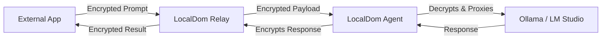
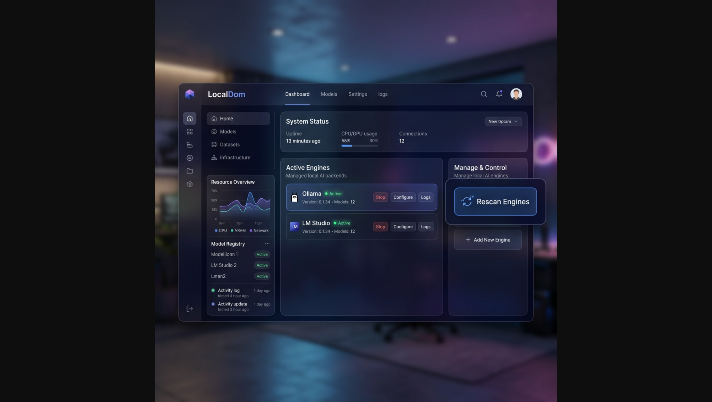

# 🪐 LocalDom: Secure API-Keys for Local LLMs

**LocalDom** turns your local LLM engines into secure, authenticated API services. It allows you to generate professional API credentials for your local AI (Ollama, LM Studio, etc.), making it seamless to use your private models anywhere—from mobile apps to external web services—with **End-to-End Encryption (E2EE)** and **Persistent Memory**.

[](https://opensource.org/licenses/MIT)


---

## ⚡ Core Architecture

LocalDom uses a **"Blind Relay"** pattern. The relay server routes traffic without seeing your prompts, which are encrypted locally by your agent.



---

## 🎨 Interface Gallery

|  |  |
| :---: | :---: |
| **Main Dashboard** | **Security Control** |

### 🔌 Seamless Connectivity
Connect your local LLMs to any external service securely via our encrypted tunnel.


---

## 🚀 Quick Start

### 1. Launch the Gateway
This builds the dashboard and starts the relay on port 9090.
```bash
npm start
```
*Note: Copy the `ld_...` API key printed in your terminal.*

### 2. Launch the Local Agent
Start the discovery agent on your local machine.
```bash
npm run agent
```

---

## 💎 v2.5 New Features

### 🧠 Infinite Session Memory
LocalDom now manages conversation context locally. Just provide the `X-LocalDom-Session` header, and the agent will automatically "stitch" your conversation history into the prompt.
- **Privacy**: History is stored on your machine, never the cloud.
- **Persistence**: Memories survive restarts in `agent/memory.json`.

### 📡 Live Engine Scanner
Tired of stale lists? The dashboard now features a **Live Rescan** button. Trigger a system-wide search for new LLM runners without restarting your agent.

### 🛡️ Security Shield
- **Rate Limiting**: Protects your machine from DDoS and brute-force key guessing.
- **Header Sanitization**: Automatically strips sensitive metadata (`Cookies`, `Host`) before proxying.
- **AES-256-GCM**: Industry-standard encryption for all tunneled traffic.

---

## 🛠️ Usage Examples

LocalDom is designed to be a drop-in replacement for any OpenAI-compatible client.

### 🐍 Python (OpenAI SDK)
```python
from openai import OpenAI

client = OpenAI(
    api_key="your_ld_key",
    base_url="http://localhost:9090/api/ollama/v1"
)

response = client.chat.completions.create(
    model="llama3",
    messages=[{"role": "user", "content": "Hello LocalDom!"}]
)
```

### 🟢 Node.js
```javascript
import OpenAI from 'openai';

const openai = new OpenAI({
  apiKey: 'your_ld_key',
  baseURL: 'http://localhost:9090/api/ollama/v1'
});

const response = await openai.chat.completions.create({
  model: 'llama3',
  messages: [{ role: 'user', content: 'What is your memory capacity?' }]
});
```

### 🌐 JavaScript (Fetch API)
```javascript
fetch('http://localhost:9090/api/ollama/v1/chat/completions', {
  method: 'POST',
  headers: {
    'Content-Type': 'application/json',
    'X-LocalDom-Key': 'your_ld_key',
    'X-LocalDom-Session': 'chat-123' // Optional memory session
  },
  body: JSON.stringify({
    model: 'llama3',
    messages: [{ role: 'user', content: 'Tell me a joke.' }]
  })
}).then(res => res.json()).then(console.log);
```

### 🐚 cURL (Terminal)
```bash
curl http://localhost:9090/api/ollama/v1/chat/completions \
  -H "X-LocalDom-Key: your_ld_key" \
  -H "Content-Type: application/json" \
  -d '{
    "model": "llama3",
    "messages": [{"role": "user", "content": "Ping!"}]
  }'
```

---

## 📄 Documentation

- [**API Reference**](docs/API.md) — Headers, Routes, and Status codes.
- [**Architecture**](docs/ARCHITECTURE.md) — Technical deep-dive.
- [**Security**](docs/SECURITY.md) — How our E2EE works.
- [**User Guide**](docs/USER_GUIDE.md) — Multi-agent setup.

---

## 📜 License & Philosophy

This project is licensed under the **MIT License**. 

### 🛑 Usage Restrictions
While the license is permissive, the creator of LocalDom maintains a strict **Non-Commercial Philosophy**:
- **100% Free Use**: This software is intended to be free for everyone.
- **No Reselling**: You are not permitted to reverse engineer this project for the purpose of selling it for profit.
- **Community First**: Keep the gateway open and private.

---

## 🛡️ License
MIT © 2026 LocalDom Team
