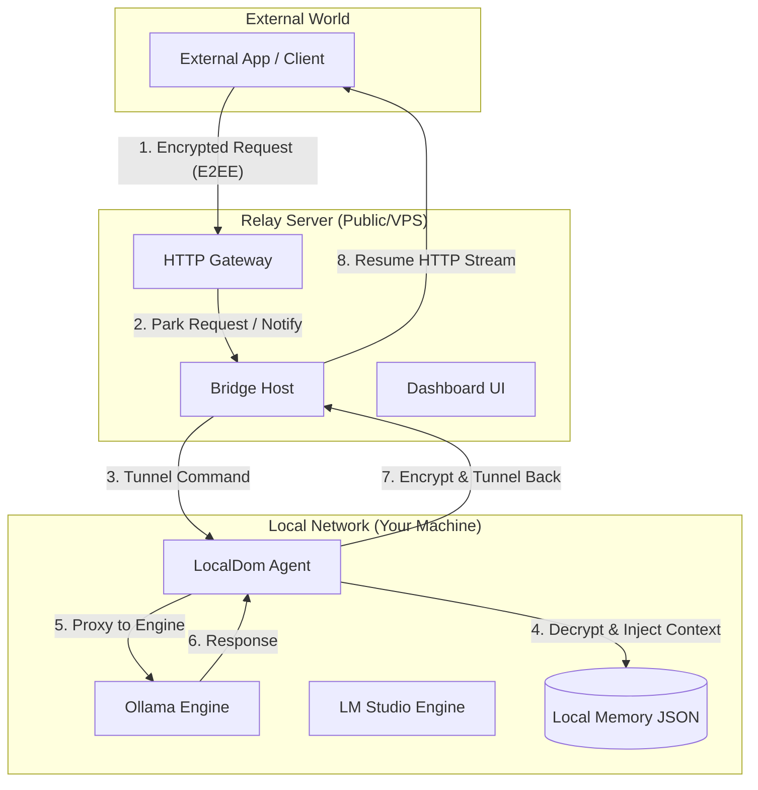

# 🏗️ Architecture

LocalDom is built as a **distributed proxy system** designed to prioritize user privacy while providing the convenience of a centralized API gateway.

## 📡 The "Blind Relay" Pattern

The core philosophy of LocalDom is the **Blind Relay**. Unlike traditional proxy servers that terminate SSL and inspect traffic, LocalDom's relay never possesses the keys required to decrypt your prompts or responses.

## 🧩 Core Components

### 1. The Relay (Relay Server)
The Relay is the central hub of the system. It handles incoming HTTP requests from clients and routes them through persistent WebSocket tunnels to the appropriate Agent.
- **Stateless Routing**: It tracks active tunnels but does not store session data.
- **Auth & Rate Limiting**: Validates API keys and prevents abuse.
- **Dashboard**: Serves the React-based management interface.

### 2. The Agent (Local Machine)
The Agent is the "brain" that lives behind your firewall. It initiates an outbound connection to the Relay, meaning you don't need to open any ports on your router.
- **Auto-Discovery**: Periodically scans local ports to find running LLM engines.
- **Memory Management**: Handles conversation history locally in `agent/memory.json`.
- **E2EE termination**: It is the only component (other than the client) that has the `ENCRYPTION_SECRET`.

### 3. The Tunnel (Protocol)
The connection between the Relay and the Agent is a high-speed WebSocket tunnel. We use a custom JSON-based protocol to multiplex multiple requests and streams over a single connection.
- **Chunked Streaming**: Native support for LLM token streaming.
- **Reliability**: Automatic reconnection logic if the socket drops.

## 🔐 Security Layer
All data passing through the tunnel is encrypted using **AES-256-GCM**.
- **The Relay is Blind**: The Relay server only sees the "envelope" (Message ID, Engine Name). The contents are encrypted blobs.
- **Identity Verification**: Agents identify themselves with a unique ID and a secret handshake.

---

## ⏭️ Read More
- [**Security Protocols**](Security-Protocols) — Deep dive into the encryption logic.
- [**API Reference**](API-Reference) — How to use the routed paths.
- [**Agent Setup**](Agent-Setup) — Detailed configuration for the local bridge.
